# Cougar Library

Cougar Library is a library management application designed for both users and employees to login and interact with their library. With this application, you can search for specific library items, borrow, place on hold, and return, create and delete item instances, and send notifications to users and employees alike.

Live Website: https://cougarlibraryy.netlify.app/<br /><br />


##  🐾 Features

###  Role-Based Login
Depending on your login credentials, our system can identfy whether you are a 'user', 'librarian', or 'admin' and take you to their respective pages.<br /><br />
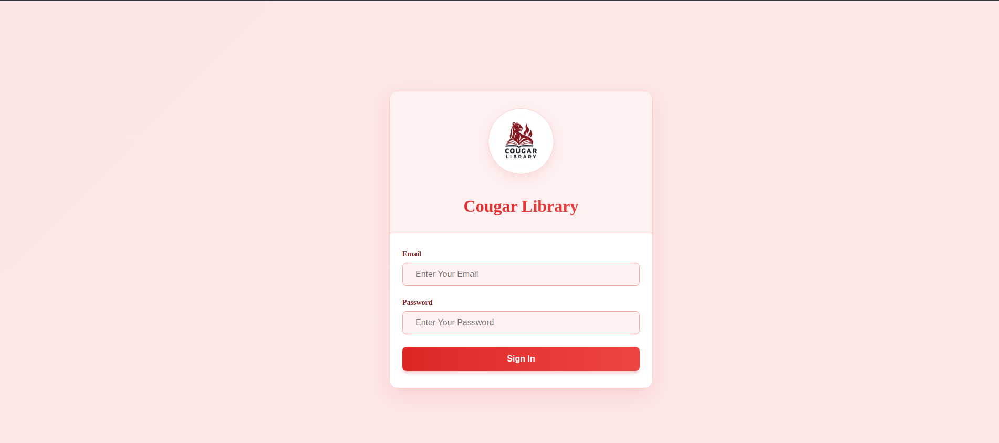 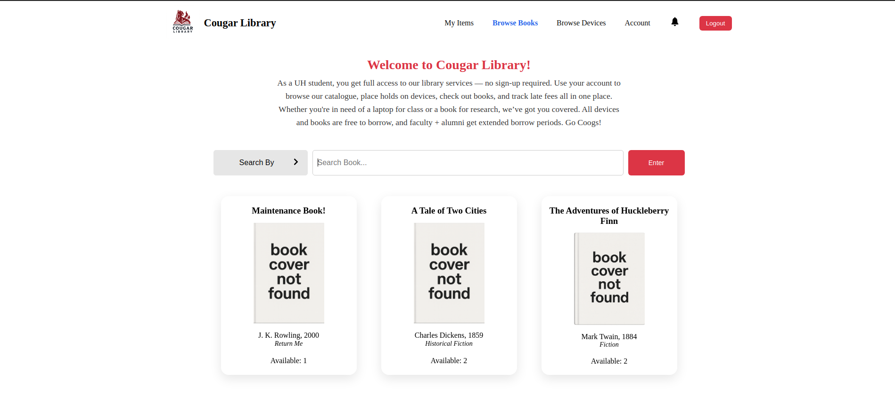 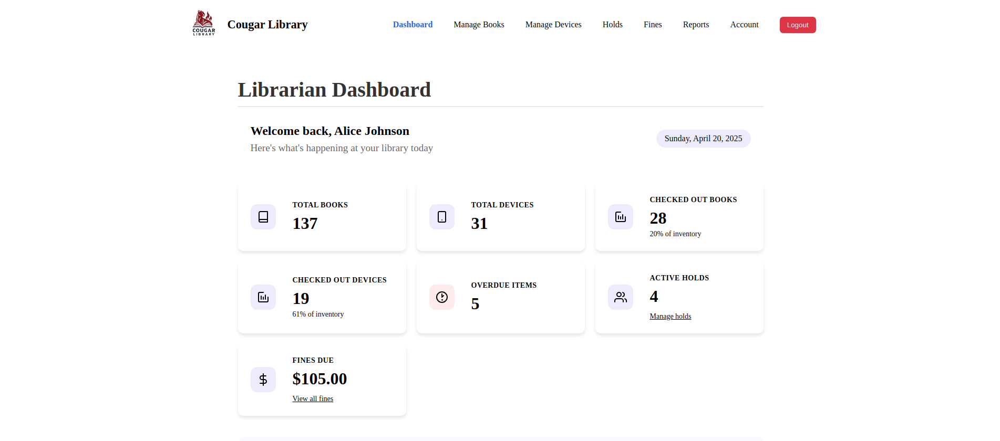 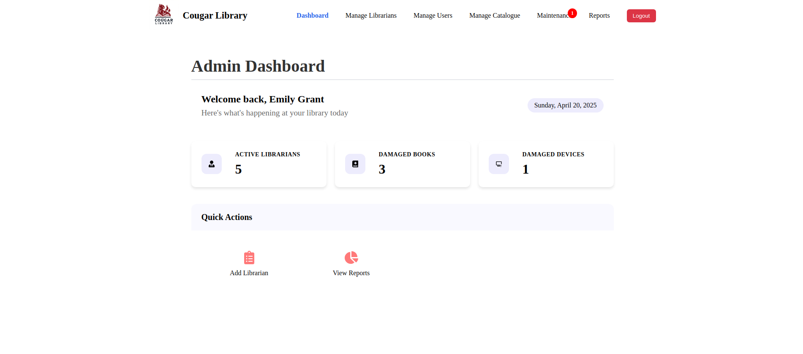<br />

### Return Items
Users are able to not only check out books and place devices on hold, but also return their books and remove their holds on items in our system.<br /><br />
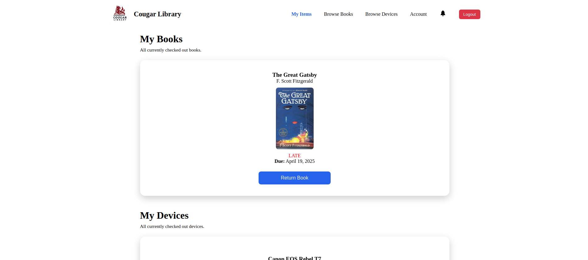 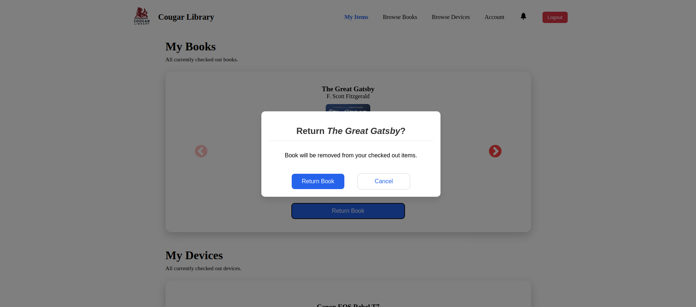<br />

### Notification System
Users are able to receive notifications generated automatically by our system and mark them as read.<br /><br />
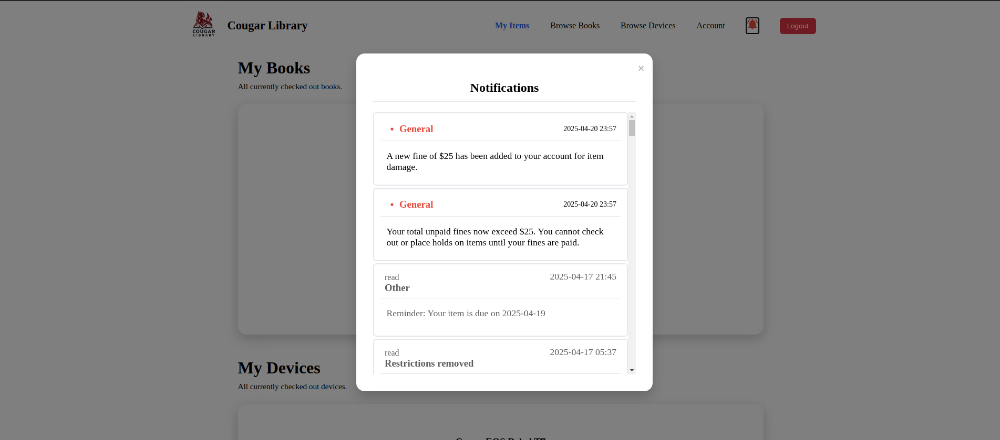 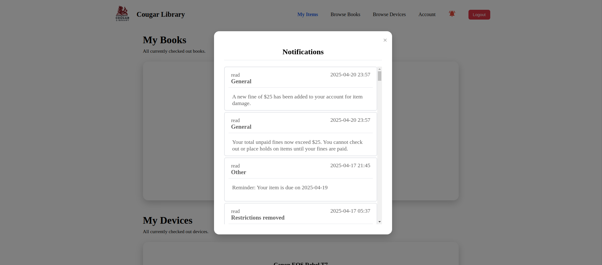<br />

### Catalogue Editing
Users and employees alike are able to browse through our library's extensive catalogue of books and devices. Employees are also able to edit existing items and add or delete new items. <br /><br />
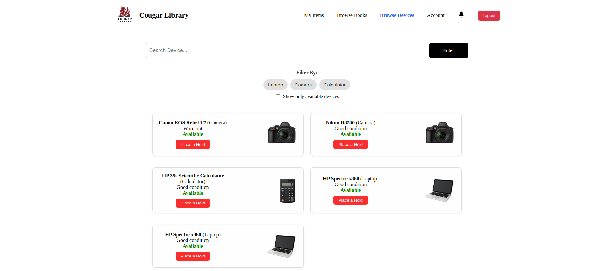 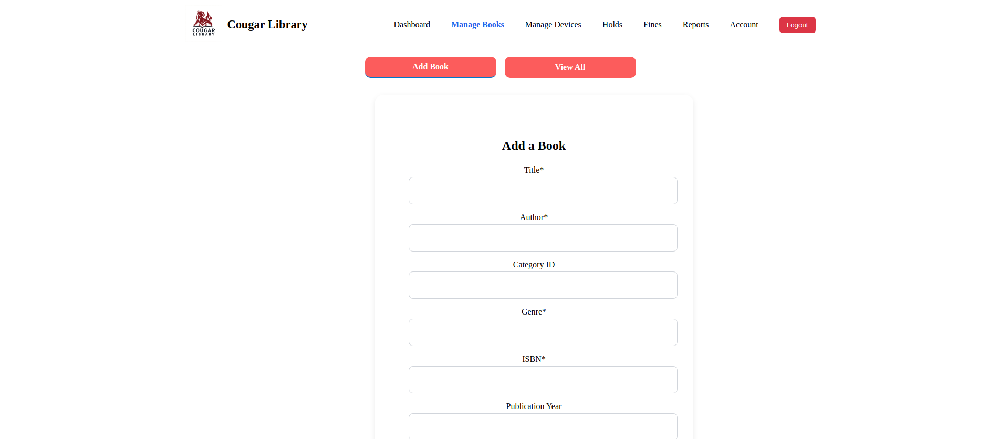<br />

### Librarian Functionalities
Librarians can manage user holds, fines, and view reports regarding the data from their library.<br /><br />
 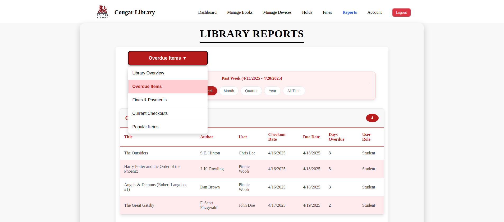<br />

### Admin Functionalities
Admins can add and edit librarians and users, manage the library catalogue, and edit the status of books currently in maintenance.<br /><br />
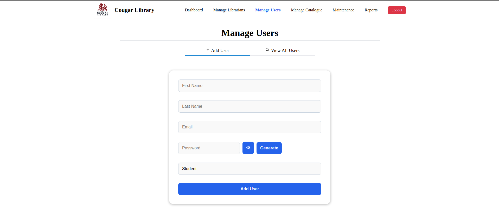 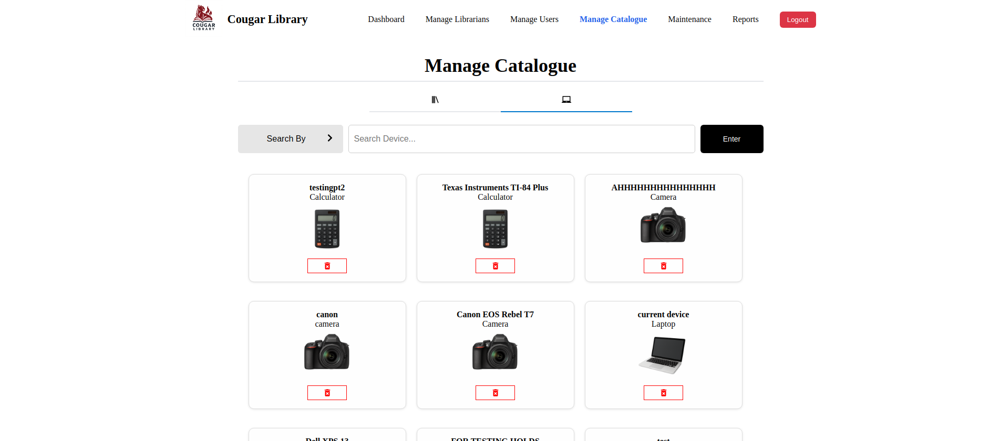<br /><br />


##  🐾 Installation & Setup

1. Clone the repository and navigate into the repo folder
```
git clone git@github.com:aadibaahmed/Library_Management_System.git
cd  Library_Management_System
```

2. Setup the backend
```
cd server
npm install
```

3. Setup the frontend
```
cd client
npm install
```
Create a .env file:
```
 REACT_APP_API_URL=http://localhost:8000
```
Then run the app:
```
npm start
```


##  🐾 Folder Structure

Library_Management_System/<br />
├── client/<br />
│   ├── public/<br />
│   └── src/<br />
├── server/<br />
│   ├── controllers/<br />
│   ├── models/<br />
│   ├── routes/<br />
│   ├── db.js<br />
│   └── server.js<br />
├── README.md<br />
└── README_images<br /><br />


##  🐾 File Explanation

### Root Directory

- `client`: frontend
- `server`: backend
- `README_images`: images used in README file

### *client* Folder

- `public`: generic index.html
- `src`: frontend components and pages like `Account.jsx`, `DeleteBook.jsx`, and `ManageLibrarians.jsx`

### *server* Folder

- `server.js`: API endpoints
- `database.js`: database connection
- controllers (`add_librarian.js`, `cancel_hold.js`, `borrow_book.js`, etc.): receive input from routes, process data, and respond<br /><br />


##  🐾 Technology Stack

**Frontend:** React<br />
**Backend:** NodeJS<br />
**Database:** MySQL<br /><br />


##  🐾 Contributors

| Name  | Github |
| ------------- | ------------- |
| Adiba Ahmed  | [@aadibaahmed](https://github.com/aadibaahmed)  |
| Maximiliano Jesse Ovalle  | [@maximilianovalle](https://github.com/maximilianovalle)  |
| Alan Tony-Itoyah  | [@atonyit](https://github.com/atonyit)  |
| Josn Gulizia  | [@jguliz](https://github.com/jguliz)  |
